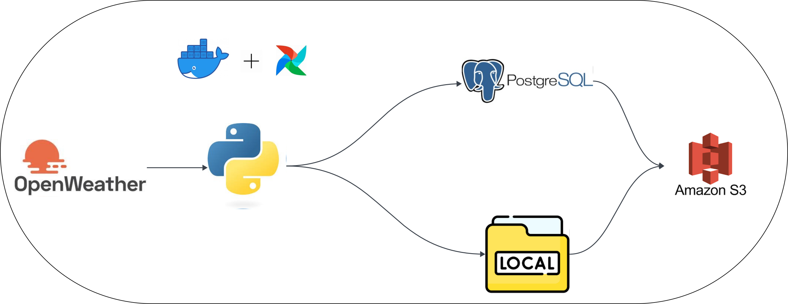

# Open-weather-API-Aiflow
This is an automated weather ETL pipeline project
# 🌦️ OpenWeather API ETL Pipeline with Apache Airflow

This project is a data pipeline that extracts weather data from the [OpenWeather API](https://openweathermap.org/api), transforms it using Python scripts, loads it into a PostgreSQL database, and stores a backup in an AWS S3 bucket. The pipeline is orchestrated using Apache Airflow and containerized using Docker Compose.

---
## Project Architecture

---
## 🚀 Features

- ⛅ Fetches current weather data for specified cities from OpenWeather API
- 🧮 Stores structured weather data in PostgreSQL
- ☁️ Uploads processed weather files to AWS S3
- 📅 Scheduled and managed using Apache Airflow (via Docker)

---

## 🧰 Tech Stack

- **Python**
- **Apache Airflow**
- **Docker & Docker Compose**
- **PostgreSQL**
- **AWS S3**
- **OpenWeather API**

---

## 🗄️ Data Model

---

## 🧑‍💻 Getting Started

### 1. Clone the repo

```bash
git clone https://github.com/your-username/openweather-etl-airflow.git
cd openweather-etl-airflow

